# 焕星 (HuanXing) - 数据模型ER图

## 1. 完整ER图

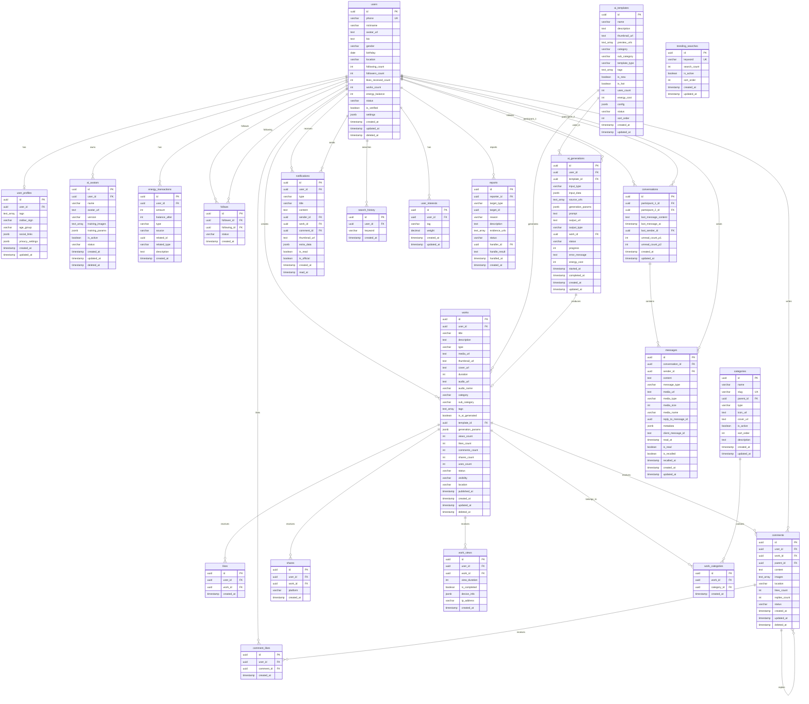

---

## 2. 核心模块关系图

### 2.1 用户社交关系
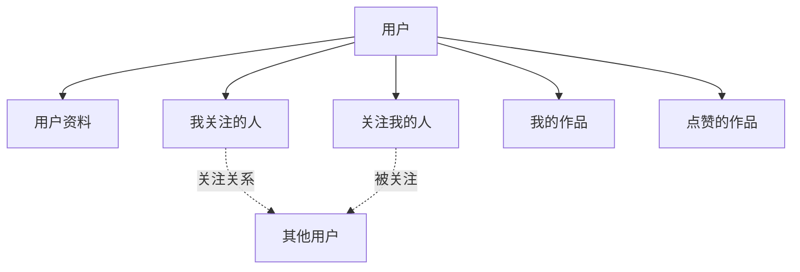

### 2.2 作品互动关系
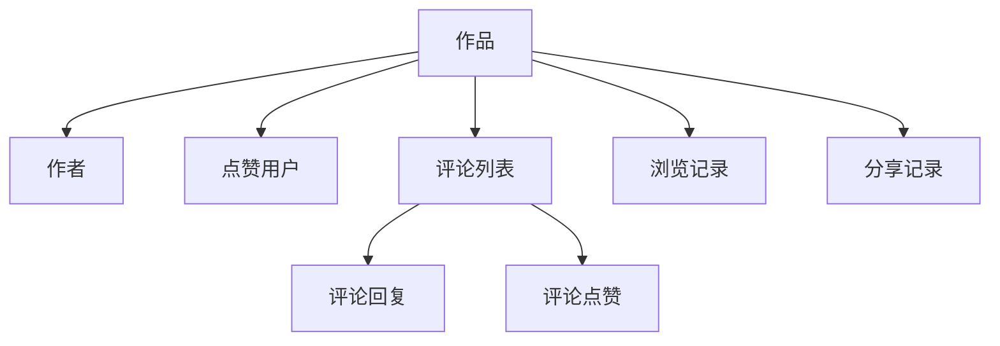

### 2.3 AI生成流程
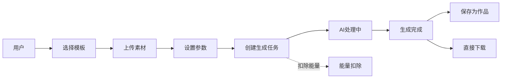

### 2.4 消息系统流程
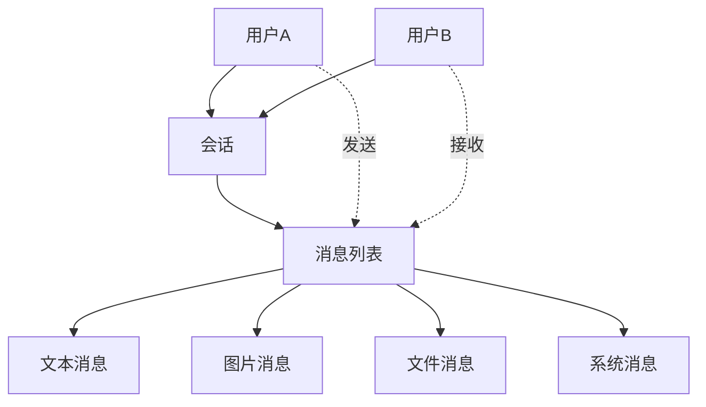

---

## 3. 数据流向图

### 3.1 用户注册登录流程
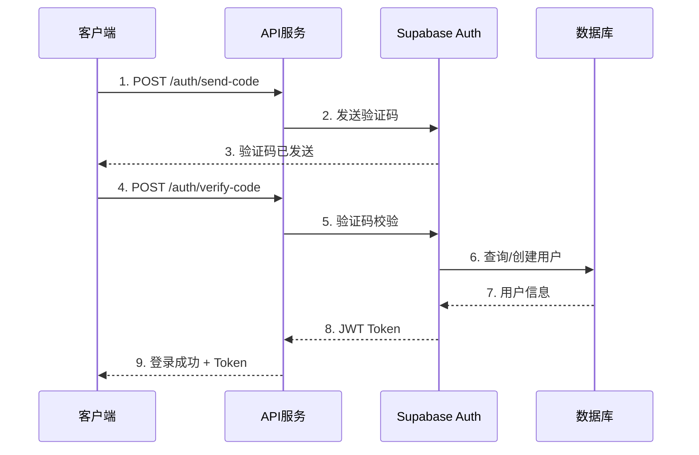

### 3.2 作品发布流程
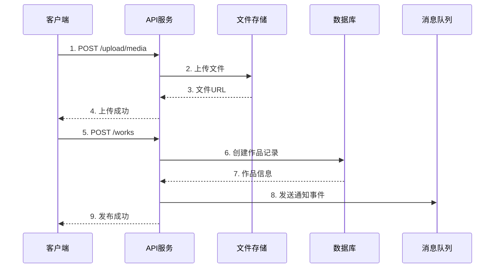

### 3.3 AI生成流程
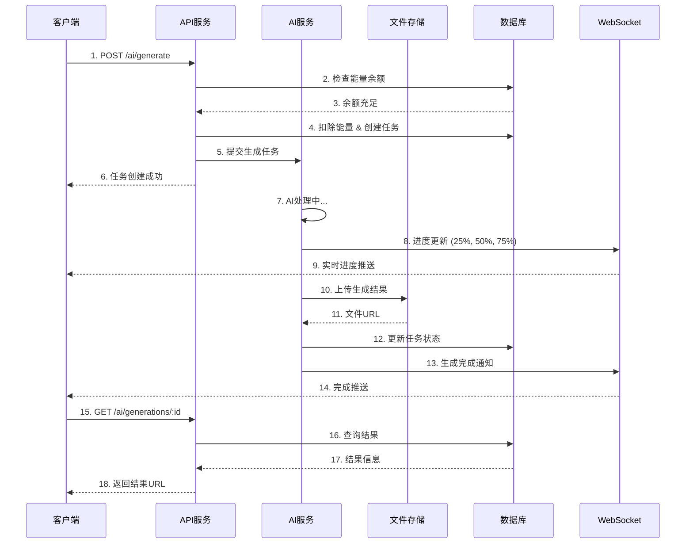

---

## 4. 关键业务逻辑

### 4.1 点赞作品业务逻辑
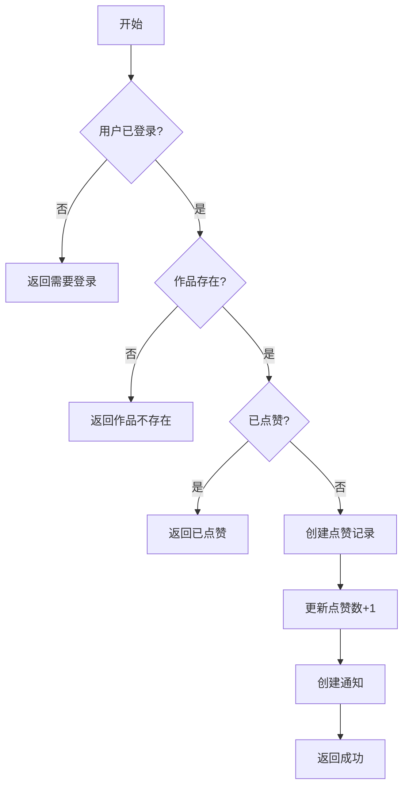

### 4.2 关注用户业务逻辑
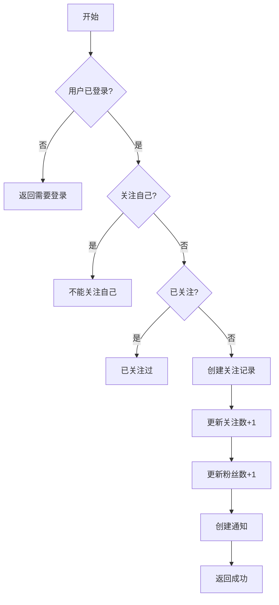

### 4.3 发送消息业务逻辑
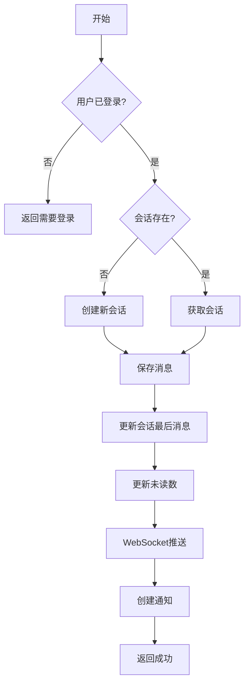

### 4.4 AI生成业务逻辑
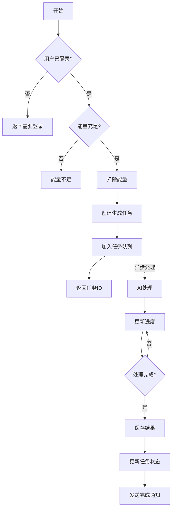

---

## 5. 索引优化策略

### 5.1 高频查询索引
```sql
-- 首页feed流查询
CREATE INDEX idx_works_feed 
ON works(status, published_at DESC, visibility) 
WHERE deleted_at IS NULL;

-- 用户作品查询
CREATE INDEX idx_works_by_user 
ON works(user_id, published_at DESC) 
WHERE deleted_at IS NULL AND status = 'published';

-- 点赞状态查询
CREATE INDEX idx_likes_check 
ON likes(user_id, work_id);

-- 关注关系查询
CREATE INDEX idx_follows_relation 
ON follows(follower_id, following_id) 
WHERE status = 'active';

-- 会话消息查询
CREATE INDEX idx_messages_by_conversation 
ON messages(conversation_id, created_at DESC);

-- 未读通知查询
CREATE INDEX idx_notifications_unread 
ON notifications(user_id, is_read, created_at DESC);
```

### 5.2 全文搜索索引
```sql
-- 作品全文搜索
CREATE INDEX idx_works_search 
ON works USING gin(to_tsvector('chinese', title || ' ' || description));

-- 用户昵称搜索
CREATE INDEX idx_users_nickname_search 
ON users USING gin(to_tsvector('chinese', nickname));
```

---

## 6. 数据一致性保证

### 6.1 事务操作示例

#### 关注用户（确保原子性）
```sql
BEGIN;
  -- 创建关注记录
  INSERT INTO follows (follower_id, following_id) 
  VALUES ($1, $2);
  
  -- 更新关注数
  UPDATE users SET following_count = following_count + 1 
  WHERE id = $1;
  
  -- 更新粉丝数
  UPDATE users SET followers_count = followers_count + 1 
  WHERE id = $2;
  
  -- 创建通知
  INSERT INTO notifications (user_id, type, sender_id, content) 
  VALUES ($2, 'follow', $1, '关注了你');
COMMIT;
```

#### 点赞作品（确保原子性）
```sql
BEGIN;
  -- 创建点赞记录
  INSERT INTO likes (user_id, work_id) 
  VALUES ($1, $2);
  
  -- 更新点赞数
  UPDATE works SET likes_count = likes_count + 1 
  WHERE id = $2;
  
  -- 更新作者获赞总数
  UPDATE users SET likes_received_count = likes_received_count + 1 
  WHERE id = (SELECT user_id FROM works WHERE id = $2);
  
  -- 创建通知
  INSERT INTO notifications (user_id, type, sender_id, work_id, content) 
  VALUES (
    (SELECT user_id FROM works WHERE id = $2), 
    'like', 
    $1, 
    $2, 
    '赞了您的作品'
  );
COMMIT;
```

---

## 7. 缓存策略

### 7.1 Redis缓存键设计

```
# 用户信息缓存
user:{user_id}                    -> 用户基本信息 (TTL: 1小时)
user:{user_id}:stats              -> 用户统计数据 (TTL: 5分钟)

# 作品信息缓存  
work:{work_id}                    -> 作品详情 (TTL: 30分钟)
work:{work_id}:comments           -> 评论列表 (TTL: 5分钟)

# 关注关系缓存
follow:{user_id}:{target_id}      -> 关注状态 (TTL: 10分钟)

# 点赞状态缓存
like:{user_id}:{work_id}          -> 点赞状态 (TTL: 10分钟)

# feed流缓存
feed:recommend:{user_id}          -> 推荐feed (TTL: 2分钟)
feed:following:{user_id}          -> 关注feed (TTL: 1分钟)

# 热门内容缓存
trending:works                    -> 热门作品 (TTL: 10分钟)
trending:searches                 -> 热门搜索 (TTL: 30分钟)

# 会话缓存
conversation:{conv_id}:messages   -> 消息列表 (TTL: 5分钟)
user:{user_id}:unread_count       -> 未读消息数 (TTL: 1分钟)
```

### 7.2 缓存更新策略
- **主动更新**: 数据变更时立即更新缓存
- **被动失效**: TTL过期后自动失效
- **穿透保护**: 空值也缓存（TTL较短）
- **雪崩保护**: 随机TTL偏移

---

## 8. 数据权限矩阵

### 8.1 作品权限
| 操作 | 作者 | 粉丝 | 普通用户 | 未登录 |
|------|------|------|----------|--------|
| 查看公开作品 | ✓ | ✓ | ✓ | ✓ |
| 查看私密作品 | ✓ | ✗ | ✗ | ✗ |
| 查看粉丝可见作品 | ✓ | ✓ | ✗ | ✗ |
| 编辑作品 | ✓ | ✗ | ✗ | ✗ |
| 删除作品 | ✓ | ✗ | ✗ | ✗ |
| 点赞作品 | ✓ | ✓ | ✓ | ✗ |
| 评论作品 | ✓ | ✓ | ✓ | ✗ |
| 分享作品 | ✓ | ✓ | ✓ | ✓ |

### 8.2 用户资料权限
| 操作 | 本人 | 其他用户 |
|------|------|----------|
| 查看公开资料 | ✓ | ✓ |
| 查看手机号 | ✓ | ✗ |
| 编辑资料 | ✓ | ✗ |
| 查看能量余额 | ✓ | ✗ |
| 查看设置 | ✓ | ✗ |

---

## 9. 性能优化建议

### 9.1 数据库查询优化
1. **使用连接池**: 限制最大连接数
2. **预编译语句**: 防止SQL注入，提升性能
3. **批量操作**: 减少数据库往返次数
4. **读写分离**: 读操作使用只读副本
5. **分页优化**: 使用游标分页而非offset

### 9.2 N+1查询问题解决
```typescript
// 不好的做法（N+1查询）
const works = await db.works.findMany()
for (const work of works) {
  work.author = await db.users.findUnique({ where: { id: work.user_id } })
}

// 好的做法（关联查询）
const works = await supabase
  .from('works')
  .select(`
    *,
    author:users(id, nickname, avatar_url)
  `)
```

### 9.3 热点数据缓存
```typescript
// 缓存热门作品
const cacheKey = 'trending:works'
let hotWorks = await redis.get(cacheKey)

if (!hotWorks) {
  hotWorks = await db.query(`
    SELECT * FROM hot_works_mv
    LIMIT 100
  `)
  await redis.setex(cacheKey, 600, JSON.stringify(hotWorks))
}
```

---

## 10. 数据备份恢复方案

### 10.1 备份策略
- **全量备份**: 每日凌晨3点自动备份
- **增量备份**: 每小时备份WAL日志
- **异地备份**: 备份文件同步到异地存储
- **保留策略**: 保留最近30天备份

### 10.2 恢复测试
定期（每月）进行备份恢复演练，确保备份可用。

---

**文档维护者**: 技术团队  
**最后更新**: 2025-10-28

